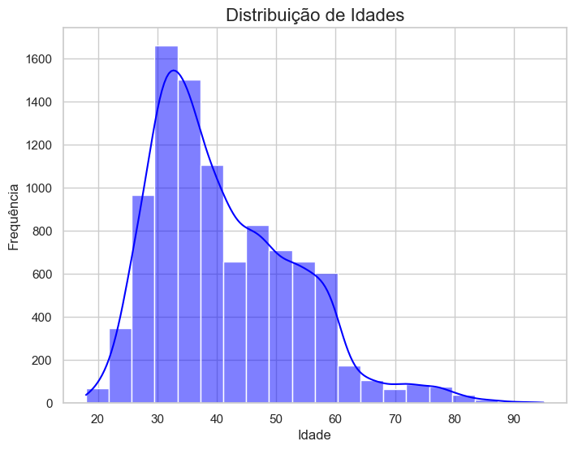
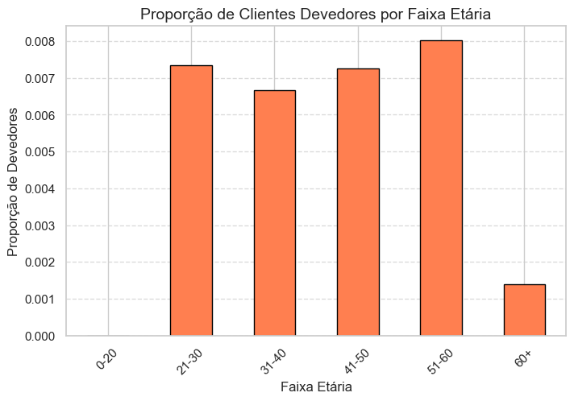

# Análise de Inadimplência por Faixa Etária  

Este repositório documenta uma análise de dados exploratória focada em compreender como diferentes faixas etárias se relacionam com a inadimplência de clientes em um banco. Utilizando visualizações e estatísticas descritivas, esta análise destaca padrões críticos para ajudar na tomada de decisões financeiras.

## Objetivo  

- Identificar faixas etárias com maior risco de inadimplência.  
- Avaliar como a distribuição da idade está relacionada ao comportamento financeiro.  
- Gerar insights para embasar políticas de crédito e gestão de risco.  

## Dados e Visualizações  

### Distribuição de Idades  
O primeiro gráfico mostra a distribuição etária dos clientes:  

  

- A maioria dos clientes está entre 20 e 40 anos, com um pico em torno dos 30 anos.  
- Há uma diminuição gradativa na frequência de clientes à medida que a idade aumenta após os 40 anos.  

### Proporção de Clientes Devedores por Faixa Etária  
O gráfico a seguir destaca a proporção de inadimplência em cada faixa etária:  

  

- As faixas 21-30 e 51-60 anos apresentam as maiores taxas de inadimplência.  
- Clientes acima de 60 anos têm uma baixa proporção de inadimplência, sugerindo maior estabilidade financeira.  

## Principais Insights  

### Risco Concentrado em Jovens e Meia-Idade  
- Clientes jovens (21-30 anos) podem enfrentar desafios financeiros iniciais, como instabilidade de renda.  
- A faixa de 51-60 anos pode representar indivíduos em transições financeiras (aposentadoria, quitação de dívidas).  

### Estabilidade em Idades Avançadas  
- A inadimplência cai significativamente após os 60 anos, indicando melhor planejamento ou menor propensão a crédito elevado.  

## Implicações para o Banco  

- Políticas específicas podem ser implementadas para jovens adultos e clientes próximos à aposentadoria.  
- Educação financeira pode ajudar os clientes jovens a gerirem melhor suas finanças.  

## Ferramentas Utilizadas  

- Python: Linguagem principal para a análise.  
- Bibliotecas:  
  - pandas: Manipulação e organização de dados.  
  - matplotlib e seaborn: Criação de visualizações impactantes.

